# FridgeChef アプリケーション要件定義書

## システム概要

### プロジェクト名

FridgeChef（フリッジシェフ）

### システム概要

冷蔵庫にある食材から最適な料理を提案し、調理から記録・共有まで一貫してサポートする AI 料理アシスタント Web アプリケーション

### プロジェクトの目的

- 日々の献立決めのストレス解消（30 分 → 1 分で決定）
- 冷蔵庫の食材の有効活用と食材ロス削減
- 料理のマンネリ化解決
- 料理への自信向上と SNS 投稿の促進

### 対象ユーザー

- **プライマリーターゲット**: 料理に悩む主婦・主夫層
- **セカンダリーターゲット**: 一人暮らしの社会人、料理初心者
- **具体的ペルソナ**:
  - 「今日の夕飯何にしよう…」と毎日悩む人
  - レシピサイトを見ても「この食材ない」となる人
  - 買い物に行く前に、家にあるもので済ませたい人
  - 作った料理を SNS に投稿したい人

### 解決したい課題

1. 日々の献立決めの時間とストレス
2. 冷蔵庫の食材を無駄にしてしまう問題
3. 料理のマンネリ化
4. 料理への自信不足
5. SNS 映えする料理写真が撮れない問題

### システムの特徴・差別化ポイント

- 冷蔵庫の食材ベースでの料理提案
- AI 生成による理想的な完成ビジュアル表示（MVP では実装しない）
- 完成写真と AI 理想写真の比較機能（MVP では実装しない）
- カテゴリ別アイコンによる直感的な食材選択

## 機能要件

### 必須機能（MVP）

#### F001: 食材入力機能

**概要**: ユーザーが保有する食材を入力・管理する機能

**詳細機能**:

- F001-1: カテゴリ別アイコンチェックリスト表示
  - 野菜類（ニンジン、玉ネギ、ジャガイモ等）
  - 肉類（豚肉、牛肉、鶏肉、ひき肉等）
  - 冷蔵庫の定番（卵、牛乳、バター、チーズ等）
- F001-2: 手動テキスト入力による食材追加
- F001-3: 食材検索・候補表示機能
- F001-4: 選択済み食材の表示・削除機能

**入力**: 食材選択操作、テキスト入力  
**出力**: 選択済み食材リスト  
**業務ルール**:

- 1 回のセッションで最大 50 個まで食材選択可能
- 重複した食材は自動的に除外

#### F002: 条件指定機能

**概要**: 料理提案の条件を指定する機能

**詳細機能**:

- F002-1: 調理時間指定（15 分以内/30 分以内/こだわり）
- F002-2: 人数指定（1 人/2-3 人/4 人以上）
- F002-3: 難易度指定（超簡単/普通/ちょっと頑張る）
- F002-4: ジャンル指定（和食/洋食/中華/エスニック/その他）
- F002-5: 気分指定（さっぱり/ガッツリ/ヘルシー）

**入力**: 条件選択  
**出力**: 選択された条件情報

#### F003: AI 料理提案機能

**概要**: 保有食材と条件に基づいて AI が料理を提案する機能

**詳細機能**:

- F003-1: 保有食材に基づく 3 パターンのレシピ提案
- F003-2: 条件フィルタリング適用
- F003-3: 各レシピの人気度・評価表示

**入力**: 食材リスト、条件情報  
**出力**: レシピ提案 3 件、完成イメージ画像  
**業務ルール**:

- 最低 2 つ以上の食材がある場合のみ提案実行

#### F004: レシピ詳細表示機能

**概要**: 選択されたレシピの詳細情報を表示する機能

**詳細機能**:

- F004-1: 材料リスト表示（保有食材/購入必要な調味料）
- F004-2: ステップバイステップの調理手順
- F004-3: 工程写真付きガイド
- F004-4: 調理時間・難易度・人数の表示
- F004-5: 栄養情報の概算表示
- F004-6: お気に入り登録機能

**入力**: レシピ ID  
**出力**: レシピ詳細情報、工程画像

#### F005: レシピ保存機能

**概要**: ユーザーが採用し、調理をしたレシピの記録・管理をする機能

**詳細機能**:

- F005-1: ユーザー撮影写真アップロード
- F005-2: 作成日時・評価・メモの記録
- F005-2: 個人レシピアーカイブへの保存

**入力**: ユーザー撮影写真、評価（1-5）、メモ  
**出力**: 比較画面、フィードバックメッセージ

#### F006: ユーザー管理機能

**概要**: ユーザーの認証・プロフィール管理機能

**詳細機能**:

- F007-1: メールアドレス認証による新規登録
- F007-2: ログイン・ログアウト機能
- F007-3: プロフィール情報管理
- F007-4: パスワード変更・リセット機能
- F007-5: アカウント削除機能

**入力**: 認証情報、プロフィール情報  
**出力**: 認証結果、ユーザー情報

#### F007: アーカイブ管理機能

**概要**: 過去の料理記録を管理する機能

**詳細機能**:

- F008-1: 料理記録の一覧表示
- F008-2: ジャンルによる検索・フィルタ
- F008-3: 料理記録の編集・削除

### 将来実装機能

#### F101: 写真アップロード機能

- ファイル選択による食材認識
- カメラ撮影機能（ブラウザ対応範囲内）

#### F102: 音声入力機能

- Web Speech API による音声認識
- 食材名の音声入力サポート

#### F103: よく使う食材記憶機能

- 利用履歴に基づく食材候補表示
- 個人向けカスタマイズ機能

#### F104: 栄養計算・健康管理機能

- カロリー・栄養素の自動計算
- 健康目標に基づく料理提案

#### F105: 週間献立プランナー

- 1 週間分の献立自動生成
- 買い物リスト自動作成

#### F106: ソーシャルログイン機能

- Google OAuth 連携
- Apple Sign-In 連携


## 非機能要件

### 性能要件

- **レスポンス時間**:
  - レシピ提案応答時間: 5〜10 秒以内
  - 画像生成処理時間: 10〜15 秒以内
  - ページ読み込み時間: 2 秒以内（モバイル First Contentful Paint）
- **スループット**:
  - 同時接続ユーザー数: 1,000 人
  - 月間アクティブユーザー: 10,000 人対応

### 可用性要件

- **稼働率**: 99.5%以上
- **バックアップ**: 日次自動バックアップ
- **災害復旧**: RTO 4 時間、RPO 1 時間

### セキュリティ要件

- **認証**: メールアドレス認証、将来的に多要素認証対応
- **通信**: 全通信 HTTPS 化
- **データ保護**: 個人情報暗号化、GDPR 準拠
- **画像管理**: 適切なアクセス制御、定期削除ポリシー

### ユーザビリティ要件

- **対応デバイス**: スマートフォン、タブレット、PC
- **対応ブラウザ**: Chrome, Safari, Firefox, Edge（最新 2 バージョン）
- **レスポンシブデザイン**: モバイルファースト設計
- **アクセシビリティ**: WCAG 2.1 AA 準拠

### 保守性要件

- **コード品質**: TypeScript 使用、テストカバレッジ 80%以上
- **ドキュメント**: API 仕様書、運用手順書の整備
- **監視**: アプリケーション監視、エラー追跡体制
- **CI/CD**: GitHub Actions または CircleCI による継続的インテグレーション・デプロイ

### 拡張性要件

- **水平スケーリング**: バックエンドサービスの水平分散対応
- **データベース**: 読み取りレプリカ対応
- **API**: RESTful 設計による拡張性確保

## ユーザーストーリー

### エピック 1: 食材から料理を見つける

**ユーザー**: 献立に悩む主婦
**目標**: 冷蔵庫の食材だけで今日の夕飯を決めたい

#### ストーリー 1-1: 食材選択

```
As a 献立に悩む主婦
I want to 冷蔵庫の食材を簡単に選択したい
So that 手軽に今ある材料を把握できる
```

**受け入れ条件**:

- カテゴリ別に整理された食材アイコンが表示される
- タップするだけで食材が選択できる
- 選択済み食材が分かりやすく表示される
- 食材の検索ができる

#### ストーリー 1-2: 条件指定

```
As a 忙しい主婦
I want to 調理時間や難易度を指定したい
So that 今の状況に合った料理を提案してもらえる
```

**受け入れ条件**:

- 調理時間を 3 段階で選択できる
- 難易度を 3 段階で選択できる
- 人数を選択できる
- ジャンルと気分を選択できる

#### ストーリー 1-3: AI 提案受け取り

```
As a マンネリ化に悩む主婦
I want to 3パターンの料理提案を受けたい
So that 選択肢の中から気分に合うものを選べる
```

**受け入れ条件**:

- 3 つの異なる料理が提案される
- 各料理の完成イメージが表示される
- 調理時間と難易度が分かる
- 他のユーザーの評価が見える

### エピック 2: 料理を作って記録する

**ユーザー**: 料理の記録を残したい主婦
**目標**: 作った料理を写真付きで記録して達成感を得たい

#### ストーリー 2-1: レシピ詳細確認

```
As a 料理初心者
I want to 詳細な作り方を確認したい
So that 失敗なく料理を完成させられる
```

**受け入れ条件**:

- 材料リストが保有食材と購入必要品に分かれて表示される
- 調理手順が順番に表示される
- 工程写真が表示される
- 調理のコツが表示される

#### ストーリー 2-2: 完成写真撮影・記録

```
As a 達成感を味わいたい主婦
I want to 完成した料理の写真を撮って記録したい
So that 自分の料理スキル向上を実感できる
```

**受け入れ条件**:

- 写真を簡単にアップロードできる
- AI 生成の理想写真と比較できる
- AI からポジティブなフィードバックがもらえる
- 評価とメモを記録できる

#### ストーリー 2-3: SNS シェア

```
As a SNSを利用する主婦
I want to 作った料理をSNSでシェアしたい
So that 友人や家族に自分の料理を見てもらえる
```

**受け入れ条件**:

- 写真を高画質でダウンロードできる
- シェア用のハッシュタグが提供される
- Web シェア機能が使える
- 投稿用テキストが自動生成される

### エピック 3: 過去の料理を振り返る

**ユーザー**: 料理の記録を管理したい主婦
**目標**: 過去に作った料理を振り返り、リピートしたい

#### ストーリー 3-1: アーカイブ閲覧

```
As a 過去の料理を思い出したい主婦
I want to 作った料理の記録を一覧で見たい
So that どんな料理を作ったか振り返れる
```

**受け入れ条件**:

- 作成日順で料理記録が表示される
- 写真付きで一覧表示される
- 検索・フィルタ機能が使える
- お気に入りでフィルタできる

#### ストーリー 3-2: リピート作成

```
As a 気に入った料理をまた作りたい主婦
I want to 過去に作った料理を簡単にリピートしたい
So that 家族が喜んだ料理をまた作れる
```

**受け入れ条件**:

- アーカイブからレシピ詳細に戻れる
- お気に入り登録ができる
- 材料リストを再確認できる
- 前回のメモが参照できる

## 画面遷移図



## ER 図



## システムアーキテクチャ概要



## データ要件

### データ保存要件

#### ユーザーデータ

- **ユーザー情報**: メールアドレス、表示名、認証情報
- **個人設定**: よく使う食材、料理の好み
- **保存期間**: アカウント削除まで無期限

#### 料理関連データ

- **食材マスタ**: 約 200 種類の食材情報（名前、カテゴリ、アイコン）
- **レシピデータ**: 1 万件以上のレシピ情報
- **料理記録**: ユーザーの調理履歴と写真
- **保存期間**: 料理記録は 5 年間、レシピマスタは無期限

#### 画像データ

- **ユーザー投稿画像**: 1 ファイル最大 10MB、JPEG/PNG 形式
- **AI 生成画像**: レシピの完成イメージ、工程写真
- **保存場所**: Supabase ストレージ、CDN 経由で配信
- **保存期間**: アクティブユーザーの画像は 5 年間

### データ形式

#### レシピデータ構造

```json
{
  "id": 1,
  "title": "豚肉とニンジンの甘辛炒め",
  "description": "ごはんに合う簡単おかず",
  "cooking_time": 15,
  "difficulty": 1,
  "servings": 2,
  "genre": "和食",
  "calories": 420,
  "steps": [
    {
      "step": 1,
      "instruction": "材料を切る",
      "image_url": "https://...",
      "tips": "均一に切ると火の通りが良い"
    }
  ],
  "ingredients": [
    {
      "ingredient_id": 1,
      "amount": "200g",
      "is_required": true
    }
  ]
}
```

#### 料理記録データ構造

```json
{
  "id": 1,
  "user_id": 1,
  "recipe_id": 1,
  "user_image_url": "https://...",
  "rating": 4,
  "memo": "子供がおかわりした！",
  "cooked_at": "2025-10-12T18:30:00Z",
  "ai_feedback": "とても美味しそうに作れています！"
}
```

### データ移行・バックアップ要件

#### バックアップ戦略

- **データベース**: 日次フルバックアップ、時間単位の増分バックアップ
- **画像ファイル**: Supabase ストレージの自動バックアップ機能利用
- **保存場所**: 別リージョンでの冗長化

#### データ移行

- **レシピマスタ**: CSV インポート機能
- **ユーザーデータ**: GDPR 準拠のエクスポート機能
- **画像データ**: 一括ダウンロード機能

### データ利用・分析要件

#### 利用統計

- ユーザーの食材選択パターン
- 人気レシピランキング
- API 利用状況とコスト分析
- ユーザーの継続利用率

#### プライバシー保護

- 個人を特定できない形での統計データ利用
- GDPR 準拠のデータ管理
- ユーザーの同意に基づくデータ利用

## 技術要件

### 技術スタック

#### フロントエンド

- **言語**: TypeScript
- **フレームワーク**: Next.js（SPA 構成）
- **UI ライブラリ**: Mantine
- **その他ライブラリ**:
  - TanStack Query（React Query）（データフェッチング）
  - Zustand（状態管理）
  - Framer Motion（アニメーション）
  - React Hook Form（フォーム管理）
  - @heroicons/react（アイコン）

#### バックエンド

- **言語**: TypeScript
- **フレームワーク**: NestJS
- **データベース**: PostgreSQL
- **ORM**: Prisma

#### 認証

- **認証基盤**: Supabase（GoTrue）
- **初期認証方式**: メールアドレス認証のみ対応（ソーシャルログインなし）
- **将来の拡張**: Supabase の GoTrue を使用したソーシャルログイン実装の可能性あり

#### AI・機械学習

- **画像生成**: Nano Banana (Gemini 2.5 Flash Image) / DALL-E 3
- **画像認識**: OpenAI Vision API / Google Cloud Vision API (将来実装)
- **自然言語処理**: OpenAI GPT-4

#### インフラ・デプロイ

- **ホスティング**: AWS S3 or Vercel (フロントエンド), Render (バックエンド)
- **ファイルストレージ**: Supabase ストレージ機能
- **CDN**: Cloudflare

### 開発環境要件

#### 必要なツール・環境

- **Node.js**: v18 以上
- **npm**: v9 以上
- **PostgreSQL**: v14 以上
- **Git**: バージョン管理

#### 開発ツール

- **IDE**: Visual Studio Code 推奨
- **リンター**: ESLint
- **フォーマッター**: Prettier
- **テストフレームワーク**: Jest, React Testing Library
- **型チェック**: TypeScript

### API 設計要件

#### RESTful API 設計

- **認証**: Bearer Token（JWT）
- **レスポンス形式**: JSON
- **ステータスコード**: HTTP 標準準拠
- **バージョニング**: URL パスに v1/v2 等を含める

#### 外部 API 連携

- **OpenAI API**: GPT-4, DALL-E 3
- **Nano Banana API**: 画像生成
- **Supabase API**: データベース接続、認証基盤

### セキュリティ技術要件

#### データ暗号化

- **通信**: TLS 1.3
- **データベース**: 保存時暗号化
- **パスワード**: bcrypt ハッシュ化

#### セキュリティヘッダー

- **CORS**: 適切な設定
- **CSP**: Content Security Policy
- **XSS 保護**: サニタイゼーション

### パフォーマンス技術要件

#### フロントエンド最適化

- **Code Splitting**: Next.js 動的インポート
- **画像最適化**: Next.js Image Optimization
- **キャッシング**: SWR/TanStack Query
- **バンドルサイズ**: Webpack Bundle Analyzer

#### バックエンド最適化

- **データベース**: インデックス最適化
- **キャッシング**: Redis（将来実装）
- **CDN**: 静的ファイル配信

---

**作成日**: 2025 年 10 月 12 日  
**最終更新日**: 2025 年 10 月 26 日  
**バージョン**: 3.0  
**作成者**: システム開発チーム
